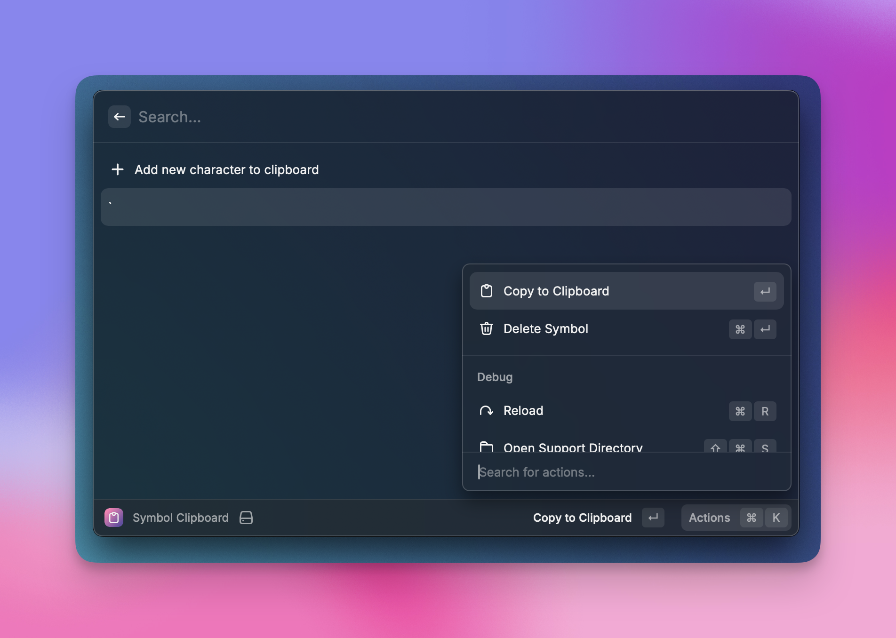

# Symbol Clipboard

Raycast extension to save a clipboard of commonly used symbols (special characters).

## Why?

Because I needed to easily copy some symbols my keyboard distribution doesn't allow me to. Raycast has a clipboard feature built in but I wanted to have a "fixed" list of symbols always available to me.
